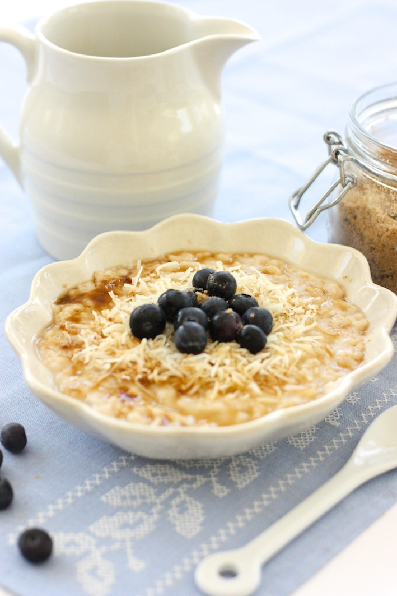

Suppose you have to choose; breakfast, lunch or dinner. You can only keep one of those eating moment in your life. The other two have to go. What would you pick? Will you keep breakfast? Or if your life not complete without dinner? Let’s be honest, it’s a weird choice to make and I am very fondly attached to all three moments, but if I had to choose? I fear I would have to go for dinner. I think. That will just give me the most options. Although never having breakfast again?? O horror!! But like I said; it’s an odd thing to ask. And why am I asking you might wonder. Well I promised you I would give you another recipe from the book Deliciously Ella and it is a breakfast. A really good one too, since I’ve been eating it almost every day since I discovered it in the book. I think it was also the first recipe that got a sticky note to it. What makes it so special is the fact that you cook the banana with the oats. So it completely melts into the porridge and the added almond butter is just so good! I top it with my own nut and seed mix and some fresh fruit and ready to go!

## Ingredients

* 40g rolled oats
* 3-4 tbsp coconut milk
* 1 banana sliced
* 1tbsp almond butter 
* 1 tbsp coconut oil
* handful of almonds 
* handful of raisins

## Method

1. Place the oats with 200 ml water in a small saucepan with the coconut milk and half the sliced banana
2. Bring to the boil and let it simmer for about 10 minutes until the liquid is absorbed. Stir in the almond butter and coconut oil and allow to cook for another minute or so until it is totally melted into the porridge.
3. Roast the almonds briefly in a dry pan and sprinkle over the porridge with the raisins.

* Serves: 1
* Preparation time: 5 minutes