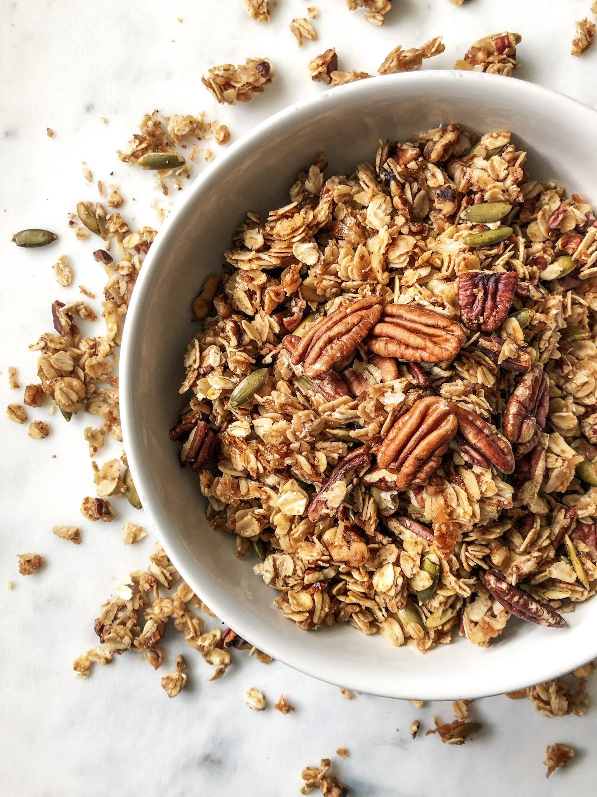

I've been eating this for breakfast every morning for about a month now and feel great. I have mine with coconut milk and blueberries and, strawberries, blueberries and some soya yoghurt.....it keeps us full until lunchtime. Make a batch it will last 10 days for 2 of you and we are big eaters!

**Ingredients** 

* 180g Pecans
* 100g Almonds
* 240g Oats
* 175g Pumpkin seeds
* 175g Sunflower seeds
* 100g Flaxseeds
* 3 tbsp Coconut oil
* 3 tbsp Maple Syrup
* 3 tsp Ground Cinammon
* 200g Raisins

**Method**

1. Preheat oven 200c (180c fan)
2. Place the pecans and almonds into a food processor and blitz until they are partially crushed
3. Place all the other ingredients except the raisins and Cinammon into a bowl with the pecans and almonds and mix together
4. Melt the coconut oil, maple syrup and cinnamon in the microwave for 1 minute
5. Place this into the dry ingredients and mix together
6. Place the mixture onto a baking sheet/s and bake for 30-40 mins until crunchy
7. Remove from the oven and allow to cool before mixing in the raisins
8. Store in an airtight container.

Serves: 2

Total time: 40 mins

