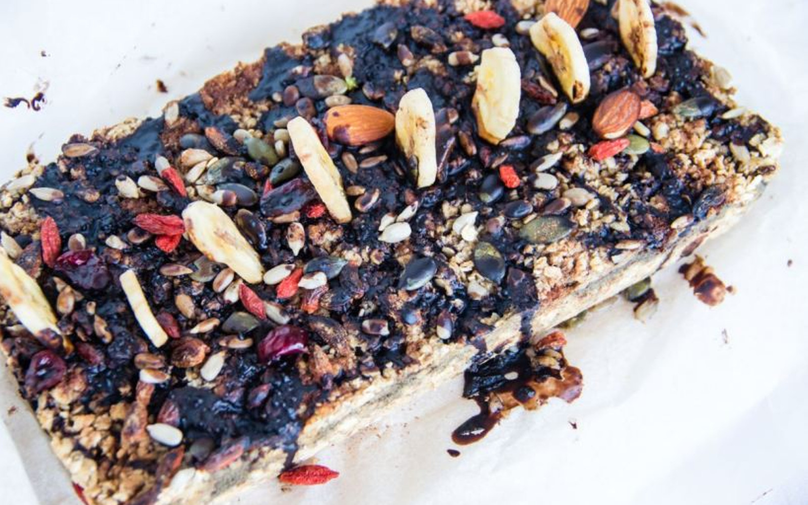

This banana bread is super! It's packed with oats, chia seeds, spirulina, chocolate chips, and other ingredients that are great for you.

### Ingredients

***Banana Bread:***

* 5 medium bananas
* 1/2 cup non-dairy milk
* 1 1/2 cups gluten-free oats
* 1 1/4 cup gluten-free oat flour
* 1/3 cup sugar/sweetener of choice
* 2 teaspoons baking powder
* 2 teaspoons baking soda
* 2 tablespoons chia seeds
* 1 tablespoon spirulina
* 1/4-1/3 cup dark chocolate chips
* 2 droppers vanilla-flavored liquid stevia

***Topping:***

* 4 tablespoons melted coconut oil
* 4 tablespoons cacao/carob powder
* 1 teaspoon sweetener (or, to taste)
* 1/4 cup mix of dried cranberries, pepitas, sunflower seeds

**Method** 

1. Preheat the oven to 356°F and line a loaf pan.
2. Mix your chia seeds with 6 tablespoons water and let it gel for a few minutes.
3. Blend your oat flour if necessary, then place all the dry ingredients in a bowl and mix.
4. In a food processor (or furiously with a fork by hand) blend (or mash) your bananas with the vanilla drops and sweetener/sugar.
5. Pour half the banana mixture into the dry ingredients with the non-dairy milk and mix.
6. Add spirulina to the other half of the banana mixture and blend briefly to mix.
7. Scoop half the batter into the loaf pan and flatten, then poke holes with a fork evenly.
8. Pour the spirulina mixture and choc chips over, then scoop the other half of the batter on top (or create crumbles).
9. Bake 25-30 minutes, then let cool completely before slicing.
10. Mix your coconut oil, sweetener and carob/cacao powder until smooth, then drizzle over the top, quickly sprinkling your dried fruits and nuts.

Serves: 8

Prep time: 10 mins