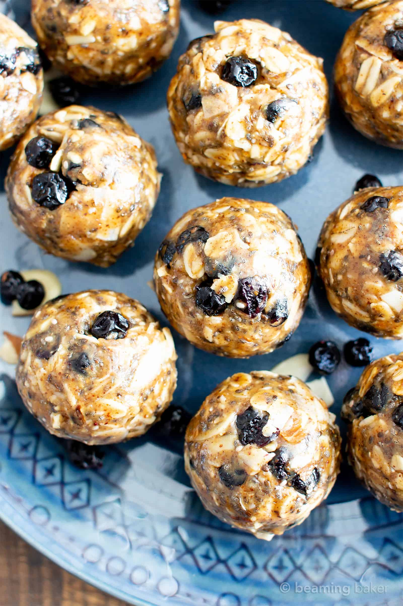

No Bake Blueberry Almond Chia Energy Bites (V, GF): a quick ‘n easy snack recipe for protein-rich no bake bites made with your favorite healthy ingredients! Vegan, Gluten-Free, Protein-Packed, Healthy Snacks.

#### dry ingredients

* ½ cup dried blueberries
* ¼ cup sliced almonds
* ¾ cup gluten-free rolled oats
* ½ cup unsweetened coconut shreds or flakes
* ¼ cup chia seeds

#### wet ingredients

* ¾ cup natural, unsalted creamy almond butter or peanut butter (mine is very liquidy)*
* ¼ cup pure maple syrup

#### optional topping

* 1 tablespoon dried blueberries
* 1 tablespoon sliced almonds

**Method**

1. In a large bowl, mix together all of the dry ingredients: blueberries, almonds, oats, coconut and chia seeds.
2. Add almond butter and maple syrup. Using a sturdy spatula, stir and fold together until well incorporated.
3. Using a cookie scoop, scoop and drop 1 to 2 tablespoons of mixture into your hands. Roll and press into bites. Here are the [1-tablespoon](https://amzn.to/2whOHZF) and [2-tablespoon cookie scoops](https://amzn.to/2tRInJ5) that I use. Optionally, press blueberries and almonds into bites. Enjoy!