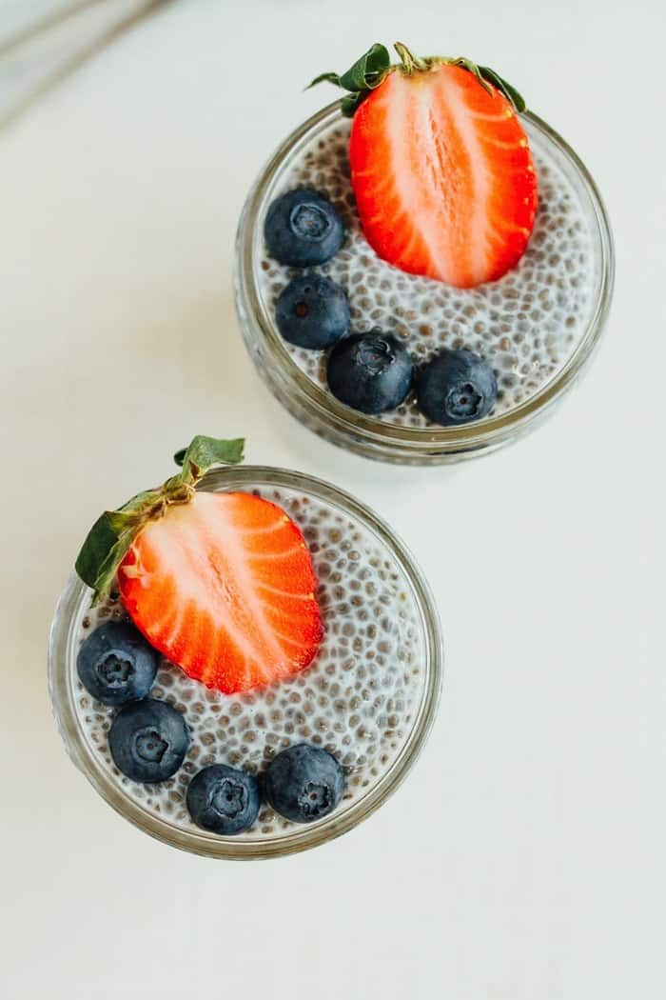

Chia pudding is the perfect healthy breakfast or snack to meal prep for the week. It’s creamy, satisfying and loaded with protein, fiber and omega-3s. Vegan, gluten-free, paleo and keto.

**Ingredients**

* 3–4 Tablespoons chia seeds
* 1 cup milk (I like unsweetened coconut, almond or cashew milk)
* 1/2 Tablespoon maple syrup, honey or sweetener of choice*
* 1/4 teaspoon vanilla (optional)
*  Toppings of choice: fresh berries or other fruit, granola, nut butter, etc

**Method**

1. **Mix**: In a bowl or mason jar, stir together chia seeds, milk, maple syrup and vanilla, if using. If you’re using a mason jar, you can put the lid on and shake the mixture to combine everything.
2. **Give it time to set**: Once the chia pudding mixture is well combined, let it sit for 5 minutes, give it another stir/shake to break up any clumps of chia seeds, cover and put the mixture in the fridge to “set” for 1-2 hours or overnight. The chia pudding should be nice and thick, not liquidy. If it’s not thick enough, just add more chia seeds (about 1 Tablespoon), stir and refrigerate for another 30 minutes or so.
3. You can also prep you pudding the night before and let it sit in the fridge overnight if that’s easier. When ready to serve top the pudding with berries and enjoy.
4. **How to store**: Chia pudding can be stored for up to 5-7 days in an airtight container in the refrigerator.