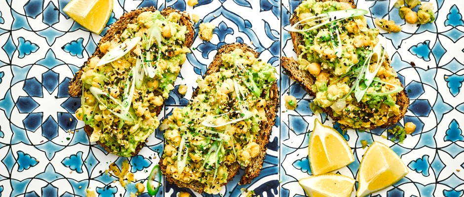

*Liven up a storecupboard staple with this super-simple dish. Chickpeas are high in fibre, especially a soluble fibre called raffinose, which is broken down by beneficial gut bacteria to support regular bowel movements. Avocado offers a bunch of healthy nutrients such as magnesium, zinc and potassium to support digestion.*

### Ingredients

* chickpeas 400g, drained and rinsed
* white miso paste 1 tbsp
* toasted sesame oil 1 tsp
* lemon 1, ½ juiced, ½ wedged to serve
* avocado 1 large
* crusty wholemeal or rye bread 4 small, thick slices, toasted
* sesame seeds a sprinkle
* spring onion 1, finely sliced on the diagonal

## Method 

* STEP 1

  Put the chickpeas, miso, sesame oil, lemon juice and some seasoning in a bowl. Use a potato masher to crush everything together until you have a rough paste.
* STEP 2

  Spoon the avocado into another bowl and break up with a fork until roughly crushed. Fold the avocado through the chickpeas, then spread over the bread. Sprinkle with the sesame seeds and sliced spring onions. Serve with lemon wedges to squeeze over.

Serves: 2

Total time: 15 mins